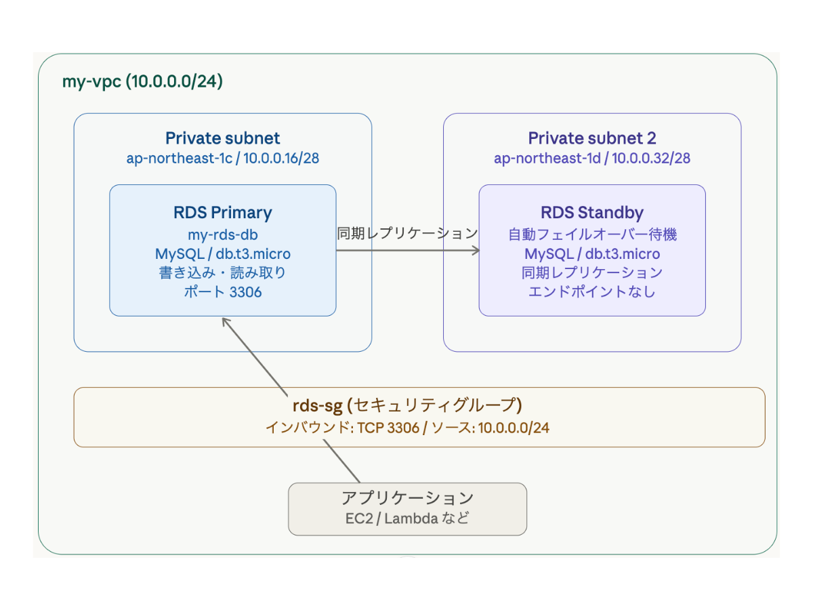

# RDS Multi-AZ 構成

## 概要
Amazon RDS を使用したMySQLデータベースのMulti-AZ構成です。
2つのアベイラビリティーゾーンに配置し、自動フェイルオーバーによる高可用性を実現しました。

## アーキテクチャ

## 使用サービス
- Amazon RDS（MySQL 8.4.7）
- Multi-AZ（自動フェイルオーバー）
- Amazon VPC / Private Subnet
- セキュリティグループ（ポート3306制限）

## 構成のポイント
- プライマリ：ap-northeast-1c
- スタンバイ：ap-northeast-1d（同期レプリケーション）
- パブリックアクセスなし（VPC内からのみ接続可）
- インバウンドは10.0.0.0/24のみ許可

## 可用性
- マルチAZ：あり
- 自動フェイルオーバー：対応
- ストレージ自動スケーリング：有効（最大1000GiB）

## 目的
高可用性を確保し、障害時でもサービスを継続できるデータベース環境を構築するため

## 課題
・単一AZ構成では障害発生時にサービス停止リスクがある  
・データ損失のリスクがある  
・負荷増加時のパフォーマンス低下  

## 解決
・RDS Multi-AZ構成を採用し、自動フェイルオーバーを実現  
・異なるAZにスタンバイを配置し、可用性を向上  
・プライベートサブネットに配置し、外部アクセスを遮断  
・セキュリティグループでアクセス制御（3306制限）  

## 結果
・高可用なデータベース環境を実現  
・障害時の自動復旧が可能  
・データ保護と安定運用を実現  

## 工夫した点
・最小権限のセキュリティ設計を意識  
・ネットワークレベルで外部アクセスを制限  
・AZ分散による耐障害性を確保  

## 改善点
・リードレプリカを追加し読み取り負荷を分散  
・バックアップ保持期間の最適化  
・Auroraへの移行によるさらなる可用性向上を検討  
